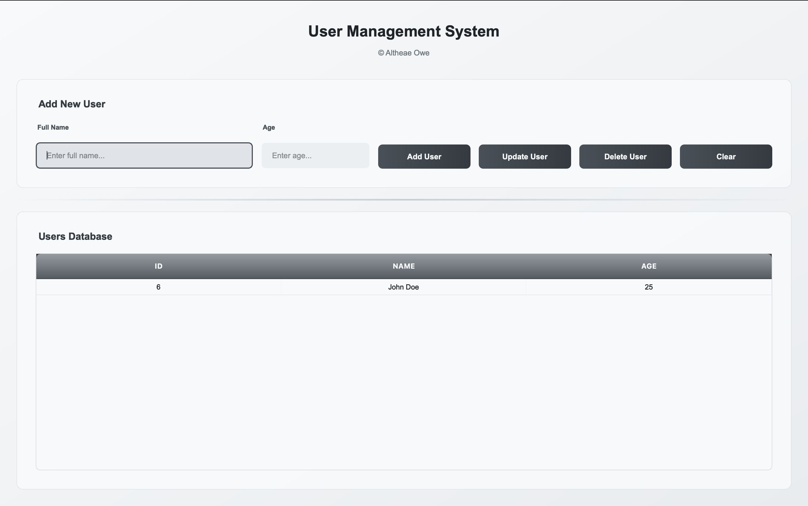

# User Management System
A sleek, modern desktop application built with PyQt5 featuring a beautiful grayscale UI and full CRUD functionality for user management.



## Features

- ✨ **Modern UI Design** - Clean grayscale aesthetic with glassmorphism effects
- 🔄 **Full CRUD Operations** - Create, Read, Update, Delete users
- 🎨 **Custom Styling** - External QSS stylesheet with fallback support
- 🗃️ **MySQL Database** - Persistent data storage
- 🖱️ **Interactive Table** - Click to select and edit users
- ⚡ **Animated Buttons** - Smooth hover and click effects
- 🔒 **Input Validation** - Form validation with error handling

## Prerequisites

Before running this application, make sure you have the following installed:

### 1. Python 3.7+

Download from [python.org](https://www.python.org/downloads/)

### 2. MySQL Server

- **Windows/macOS**: Download [MySQL Community Server](https://dev.mysql.com/downloads/mysql/)
- **Linux (Ubuntu/Debian)**:
  ```bash
  sudo apt update
  sudo apt install mysql-server
  ```
- **Linux (CentOS/RHEL)**:
  ```bash
  sudo yum install mysql-server
  ```

## Installation

### 1. Clone or Download the Project

```bash
git clone <repository-url>
cd pyqt-sample-test
```

### 2. Create and Activate Virtual Environment

**It's strongly recommended to use a virtual environment to avoid conflicts with other Python projects.**

#### Windows:

```bash
python -m venv venv
venv\Scripts\activate
```

#### macOS/Linux:

```bash
python3 -m venv venv
source venv/bin/activate
```

**Note:** You'll see `(venv)` in your terminal prompt when the virtual environment is active.

### 3. Install Python Dependencies

```bash
pip install PyQt5 mysql-connector-python
```

**Or using requirements.txt (if available):**

```bash
pip install -r requirements.txt
```

### 4. MySQL Database Setup

#### Option A: Using MySQL Command Line

1. Start MySQL service:

   ```bash
   # Windows
   net start mysql

   # macOS (using Homebrew)
   brew services start mysql

   # Linux
   sudo systemctl start mysql
   ```

2. Login to MySQL:

   ```bash
   mysql -u root -p
   ```

3. The application will automatically create the database and table on first run.

#### Option B: Using MySQL Workbench

1. Open MySQL Workbench
2. Connect to your local MySQL server
3. The application will handle database creation automatically

### 5. Configure Database Connection

Open `main.py` and modify the database connection settings if needed:

```python
conn = mysql.connector.connect(
    host="localhost",        # Change if MySQL is on different host
    user="root",            # Change to your MySQL username
    password="",            # Add your MySQL password
    port=3307              # Change to your MySQL port (default: 3306)
)
```

**Common MySQL Ports:**

- Default: `3306`
- XAMPP: `3306`
- MAMP: `3306` or `8889`
- WAMP: `3306`

## Running the Application

### 1. Start MySQL Service

Make sure your MySQL server is running before starting the application.

### 2. Activate Virtual Environment

**Important:** Always activate your virtual environment before running the application.

#### Windows:

```bash
venv\Scripts\activate
```

#### macOS/Linux:

```bash
source venv/bin/activate
```

### 3. Run the Application

```bash
python main.py
```

### 4. First Run

On the first run, the application will:

- Create a database named `test_db`
- Create a `users` table with columns: `id`, `name`, `age`
- Display the main application window

## How to Use

### Adding Users

1. Enter name and age in the input fields
2. Click "Add User" button
3. User will be added to the database and appear in the table

### Updating Users

1. Click on any row in the table to select a user
2. The form will populate with the selected user's data
3. Modify the name or age as needed
4. Click "Update User" button

### Deleting Users

1. Click on any row in the table to select a user
2. Click "Delete User" button
3. Confirm the deletion in the dialog box

### Clearing Form

- Click "Clear" button to reset the form and deselect table rows

## Troubleshooting

### Common Issues

#### 1. "ModuleNotFoundError: No module named 'PyQt5'"

**Solution:**

- Make sure your virtual environment is activated
- Install the dependency:

```bash
pip install PyQt5
```

#### 2. "ModuleNotFoundError: No module named 'mysql'"

**Solution:**

- Make sure your virtual environment is activated
- Install the dependency:

```bash
pip install mysql-connector-python
```

#### 3. "mysql.connector.errors.InterfaceError: 2003"

- Check if MySQL server is running
- Verify the host, port, username, and password in the connection settings
- Make sure MySQL is listening on the specified port

#### 4. "Access denied for user 'root'@'localhost'"

- Check your MySQL username and password
- Reset MySQL root password if necessary

#### 5. Database Connection Issues

- Verify MySQL service is running:

  ```bash
  # Windows
  net start mysql

  # macOS
  brew services start mysql

  # Linux
  sudo systemctl status mysql
  ```

### QSS Stylesheet Issues

- The application includes fallback styles if `modern_styles.qss` is not found
- Ensure `modern_styles.qss` is in the same directory as `main.py`

## File Structure

```
pyqt-sample-test/
├── main.py              # Main application file
├── modern_styles.qss    # External stylesheet
├── README.md           # This file
└── requirements.txt    # Python dependencies (optional)
```

## Customization

### Changing Colors

Edit `modern_styles.qss` to customize the appearance:

- Modify color values in the CSS-style syntax
- The current theme uses a grayscale palette
- Colors follow the pattern: `#f8f9fa` (lightest) to `#212529` (darkest)

### Database Configuration

Modify the database connection in `main.py`:

- Change database name, host, port, credentials
- Add additional fields to the users table
- Implement additional tables and relationships

## Requirements

Create a `requirements.txt` file with:

```
PyQt5==5.15.9
mysql-connector-python==8.2.0
```

## System Requirements

- **OS**: Windows 10+, macOS 10.14+, Linux (Ubuntu 18.04+)
- **Python**: 3.7 or higher
- **RAM**: Minimum 512MB, Recommended 1GB+
- **Storage**: 50MB free space
- **MySQL**: Version 5.7 or higher

## License

This project is open source and available under the [MIT License](LICENSE).

## Support

If you encounter any issues:

1. Check the troubleshooting section above
2. Verify all prerequisites are installed correctly
3. Ensure MySQL server is running and accessible
4. Check that all Python dependencies are installed

For additional help, please create an issue with:

- Your operating system
- Python version (`python --version`)
- MySQL version
- Full error message (if any)

CREDITS TO ALTHEAE OWE

# user-mngmnt-pyqt-db
